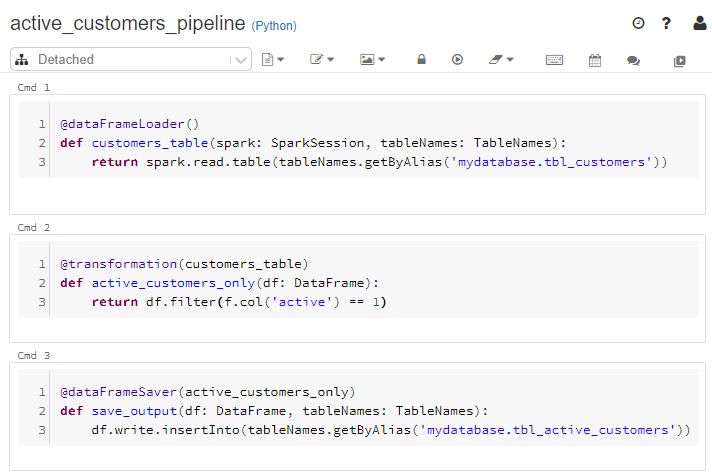

# Databricks bundle

This bundle allows you to create simple functional Databricks pipelines, which can be easily auto-documented and unit-tested. It is part of the [Bricksflow framework](https://github.com/bricksflow/bricksflow).



## Installation

Install the bundle via Poetry:

```
$ poetry add databricks-bundle && poetry add databricks-connect --dev
```

Add the `DatabricksBundle.autodetect()` to your application's **Kernel.py** to activate it:

```python
from pyfony.kernel.BaseKernel import BaseKernel
from databricksbundle.DatabricksBundle import DatabricksBundle

class Kernel(BaseKernel):
    
    def _registerBundles(self):
        return [
            # ...
            DatabricksBundle.autodetect(),
            # ...
        ]
```

## Usage

1. [Writing functional pipelines](docs/pipelines.md)
1. [Recommended pipelines structure](docs/structure.md)
1. [Configuring pipelines](docs/configuration.md)
1. [Using dependencies](docs/dependencies.md)
1. [Databricks Connect setup](docs/databricks-connect.md)
