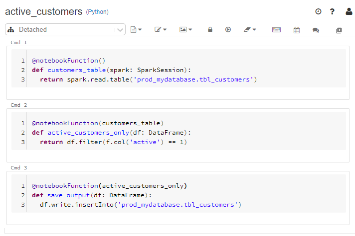

# Databricks bundle

This bundle allows you to write **beautiful function-based notebooks**.



Compared to bare notebooks, the function-based approach brings the **following advantages**: 

1. create and publish auto-generated documentation and lineage of notebooks and pipelines (Daipe PRO) 
1. write much cleaner notebooks with properly named code blocks
1. (unit)test specific notebook functions with ease
1. use YAML to configure your notebooks for given environment (dev/test/prod/...)
1. utilize pre-configured objects to automate repetitive tasks

Function-based notebooks have been designed to provide the same user-experience as bare notebooks.
Just write the function, annotate it with the `@notebookFunction` decorator and run the cell.

This bundle is the main part of the [Daipe framework](https://github.com/daipe/).

## Installation

Install the bundle via Poetry:

```
$ poetry add databricks-bundle && poetry add databricks-connect --dev
```

## Usage

1. [Writing function-based notebooks](docs/notebook-functions.md)
1. [Using pre-configured objects](docs/dependencies.md)
1. [Configuring notebook functions](docs/configuration.md)
1. [Databricks Connect setup](docs/databricks-connect.md)
