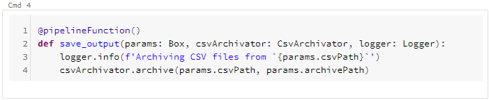

## Writing functional pipelines

This bundle allows you to write functional pipelines, that provides the same user-experience as if you code without any functions.
Just write the function, annotate it with a proper decorator and run the cell.  

There are **4 types of pipeline functions**:
 
`@dataFrameLoader` - loads some Spark dataframe (from Hive table, csv, ...) and returns it

`@transformation` - transforms given dataframe(s) (filter, JOINing, grouping, ...) and returns the result

`@dataFrameSaver` - saves given dataframe into some permanent storage (parquet, Delta, csv, ...)

`@pipelineFunction` - general pipeline function that may contain any arbitrary code; it gets automatically invoked once you run the notebook cell 

___

Next section: [Recommended pipelines structure](structure.md)
